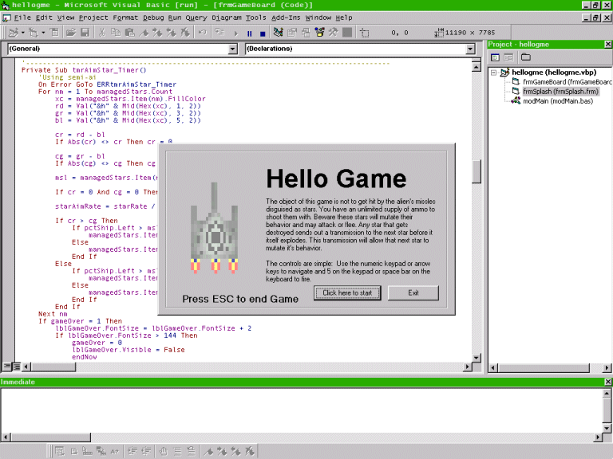



## HelloGame

### Description

To experiment making games. I was inspired by BigCalm's article on PSC about games and AI. So here it is my first game. it's just like a hello world for me. so I called it hello game.
 
### More Info
 
The object of this game is not to get hit by the alien's missles disguised as stars. You have an unlimited supply of ammo to shoot them with. Beware these stars will mutate their behavior and may attack or flee. Any star that gets destroyed sends out a transmission to the next star before it itself explodes. This transmission will allow that next star to mutate it's behavior. The controls are simple: Use the numeric keypad or arrow keys to navigate and 5 on the keypad or space bar on the keyboard to fire. The star's behavior is stored in it's fillcolor. this was convient because each object carried it's own data So you might be asking why I didn't use the tag property, because it is being used by the explo animation if a star makes it past the ship then the we do not "mutate" it's behavior Behavior is stored using RGB, red=aggresiveness. green=timidness and blue=inhibitor

             |
---                |---
**Submitted On**   |2002-10-01 14:24:38
**By**             |[Mike Firoved](https://github.com/Planet-Source-Code/PSCIndex/blob/master/ByAuthor/mike-firoved.md)
**Level**          |Intermediate
**User Rating**    |4.7 (14 globes from 3 users)
**Compatibility**  |VB 6\.0
**Category**       |[Games](https://github.com/Planet-Source-Code/PSCIndex/blob/master/ByCategory/games__1-38.md)
**World**          |[Visual Basic](https://github.com/Planet-Source-Code/PSCIndex/blob/master/ByWorld/visual-basic.md)
**Archive File**   |[HelloGame1392891012002\.zip](https://github.com/Planet-Source-Code/mike-firoved-hellogame__1-39429/archive/master.zip)

